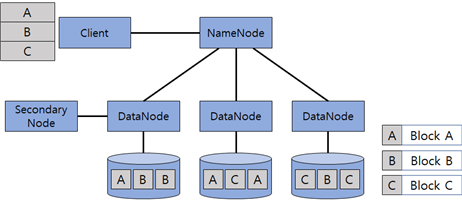
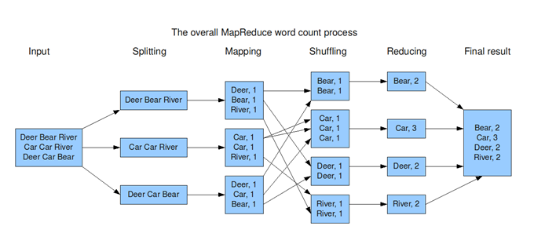

# 빅데이터

<br>

## 빅데이터 5단계 처리 과정

- 데이터 수집 -> 저장 -> 처리 -> 분석 -> 표현의 총 5단계로 구성

- 전체 처리 과정

  - 수집 단계에서 다양한 정형/비정형 데이터를 수집
  - 저장 단계에서 데이터를 분산 저장
  - 처리 단계에서 저장한 데이터를 분석 가능한 상태로 데이터를 가공, 정제
  - 분석 단계에서는 처리한 데이터에서 원하는 정보, 패턴, 관계를 찾아냄
  - 표현 단계에서는 분석한 데이터를 시각적으로 나타냄

- 단계별 처리 과정

  - 수집

    - Sqoop

      -정형데이터를 저장하는 데이터베이스의 테이블 데이터를 Sqoop이라는 도구를 이용해서 하둡의 HDFS에 분산 저장하는 수집 도구

      -RDBMS와 HDFS사이에서 import와 export를 통해 데이터를 주고받을 수 있다. import (RDBMS -> HDFS) export (HDFS -> RDBMS)

    - Flume

      -대량의 로그 데이터나 센서 데이터를 효율적으로 수집하기 위한 도구

    - Crawling
      -웹 페이지를 그대로 가져와서 원하는 데이터를 추출해 내는 수집 도구
      -크롤러를 만들기 위해 파이썬이 많이 쓰이며 그 이유는 크롤링을 하기 위한 여러 패키지들을 제공하기 때문

  - 저장

    - Hadoop (Hadoop Distributed File System)
      -대용량 데이터를 분산 처리할 수 있는 자바 기반의 오픈소스 프레임워크
      -하둡은 분산 파일 시스템인 HDFS에 데이터를 저장하고, 분산 처리 시스템인 맵리듀스를 이용하여 데이터를 처리
    - MongoDB
      -관계형 데이터베이스가 아니라 문서 지향 데이터베이스
      -행개념 대신에 보다 유연한 모델인 ‘문서’를 사용
      -고정된 형태의 스키마가 없기 때문에 새로운 필드를 추가하고 제거하는 것이 쉬워져 개발 속도를 향상시킬 수 있다.

  - 처리

    - MapReduce
      -분산 병렬 데이터 처리 기술의 표준
      -<키, 값> 입력 데이터 분할 처리 및 처리 결과 통합 기술, job 스케줄링 기술, 작업 분배 기술, 태스크 재수행 기술이 통합된 분산 컴퓨팅 기술
    - Pig
      -고수준 언어로 데이터 분석을 프로그래밍할 수 있는 빅데이터 분석 플랫폼
      -대규모 병렬 처리에 대응할 수 있는 구조라 대규모 데이터 처리가 용이하다는 특징
      -맵리듀스(MapReduce)를 사용하기 위한 높은 수준의 스크립트 언어와 이를 위한 인프라로 구성
    - Hive
      -하둡에서 동작하는 SQL 프로그램을 구현할 수 있어서 관계형 데이터베이스에 익숙한 개발자에게 좋은 인터페이스를 제공(Hive는 HiveQL 질의 언어를 이용하여 분석)
      -MapReduce는 코딩이 어렵기 때문에 Pig와 Hive를 이용여 MapReduce 처리를 훨씬 쉽게 코딩 가능

  - 분석 & 시각화

    - R
      -통계적으로 계산하고 그래픽을 처리하는 프로그래밍 언어이자 소프트웨어 환경

      -다양한 표현 라이브러리가 제공되기 때문에 다양한 표현이 가능하므로 분석된 데이터를 시각화 할 때 효율성이 향상

    - Python

<br>

## HDFS 저장 구조

<p align="center">
    
</p>

- HDFS에는 마스터 역할을 하는 네임노드와 슬레이브 역할을 하는 데이터노드 여러 대로 구성
- 네임노드의 오류를 대비하여 Secondary NameNode가 데이터노드에 존재
- 저장하는 파일은 특정 사이즈의 블록으로 나누어 분산되어 저장
- 블록들은 복제되며 각각 다른 HDFS의 노드에 분산 저장
- 네임노드는 HDFS의 메타데이터를 관리하고 클라이언트가 이를 이용하여 HDFS에 접근할 수 있다.

<br>

## MapReduce의 처리 방식

<p align="center">
    
</p>

- 워드카운트를 하는 맵리듀스 예시
  - 데이터셋이 들어오면 분리(Split)한 후 (단어 별로)
  - 맵 함수를 적용하여 각 단어를 키(단어)-값(1) 형식으로 데이터를 나눈다. (단어 - 등장 회수)
  - 매핑단계가 끝나면 셔플링 단계에서 같은 단어끼리 모아서 정리
  - 리듀스 단계에서는 중복을 제거하여 줄여나가는 과정
  - 마지막에는 나누어진 데이터를 하나로 합치면 맵리듀스 처리가 완료 (문서에서 단어의 빈도 수)

<br>

## 프로젝트

- 빅데이터 기반 의료 임상 결과 분석

  - 임상 결과를 분석하고 신뢰성을 확보하여 임상 시험 기간과 비용 등을 줄이고 임상 시험 설계 최적화를 위한 빅데이터 기반 분석 시스템 개발

  ```
    데이터 수집: Sqoop을 활용하여 RDBMS에 저장된 데이터 수집
    데이터 처리 : Hive, R을 활용한 임상 결과 데이터 정제
    데이터 분석 : R을 활용한 연관성 분석(Apriori Algorithm)
    데이터 시각화 : R을 활용한 시각화
    연구 보고서 작성
    논문 개제
  ```

- IoT 환경을 위한 빅데이터 기반 센서 데이터 처리 및 분석 연구

  - IoT 환경에서 자주 사용되는 라즈베리 파이를 이용하여 데이터를 생성하고, 다양한 빅데이터 솔루션을 사용하여 데이터를 수집, 저장, 처리, 분석 및 시각화를 통해 관계를 검증

  - 온도와 습도에 영향을 주는 요인으로 판단되는 기압, 밀도 등 다양한 센서를 활용하여 향후 날씨까지 예측할 수 있는 연구 기대  

    ```
    데이터 처리 : 이상치 제거
    데이터 분석 : R을 활용한 선형회귀분석(Linear Regression Analysis) 
                -온도 습도의 상관관계 분석
    데이터 시각화 : R을 활용한 시각화
    논문 개제
    ```

    

- 빅데이터 기반 환자 간병방법 분석 연구

  - 기존 환자 진단 데이터를 분석하여 의학적 지식이 없는 간병인이나 병원에 가기 힘든 환자에게 보다 정확한 간병방법을 제공하기 위한 빅데이터 기반 분석 시스템 개발

  ```
    데이터 수집 : 간병인 온라인 설문조사, 의료 홈페이지, 공공데이터
    데이터 저장 : 1대의 Name Node와 3대의 Data Node로 이루어진 하둡 완전 분산 모드 구축
    데이터 처리 : R을 활용한 데이터 정제
    데이터 분석 : R을 활용한 분류 분석(KNN Algorithm)
    데이터 시각화 : R shiny을 활용한 R 시각화 웹 구현
    공공데이터 시각화 및 분석 : Tableau를 활용한 시각화 및 분석
  ```

- 미세먼지 감소를 위한 대중교통 만족도 분석

  - 대중교통 이용률과 만족도에 영향을 미치는 요소를 분석하여 대중교통 이용률을 증가시키고 미세먼지를 감소시키기 위한 빅데이터 기반 분석 시스템 개발

  ```
    공공데이터 수집
    데이터 저장 : 1대의 Name Node와 3대의 Data Node로 이루어진 하둡 완전 분산 모드 구축
    데이터 처리 : R을 활용한 데이터 정제
    데이터 분석 : R을 활용한 다중선형회귀분석(Multiple Linear Regression Analysis)
    데이터 시각화 : R을 활용한 시각화
  ```
  